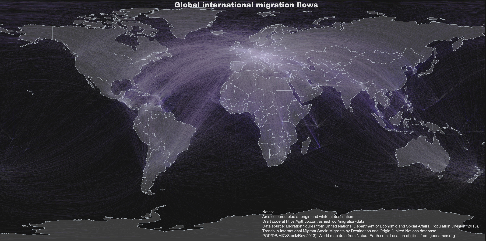

Reading UN migration data in R
=========

This library is designed to read and visualise migration datasets from United Nations, Department of Economic and Social Affairs site.

## Description of data

### Migration data

The data from stock migration is from the United Nations, Department of Economic and Social Affairs site http://esa.un.org/unmigration/TIMSA2013/migrantstocks2013.htm
For mapping, world map shape file from NaturalEarth.com ne_10m_admin_0_countries layer is used. A table of countries and regions and their appropriate two character codes was made using data from https://developers.google.com/public-data/docs/canonical/countries_csv with a few additions.

## Functions

## Example

## References

